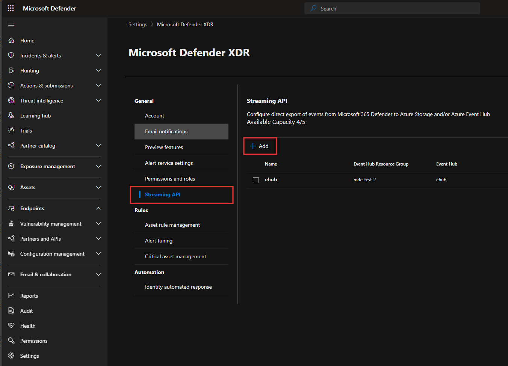
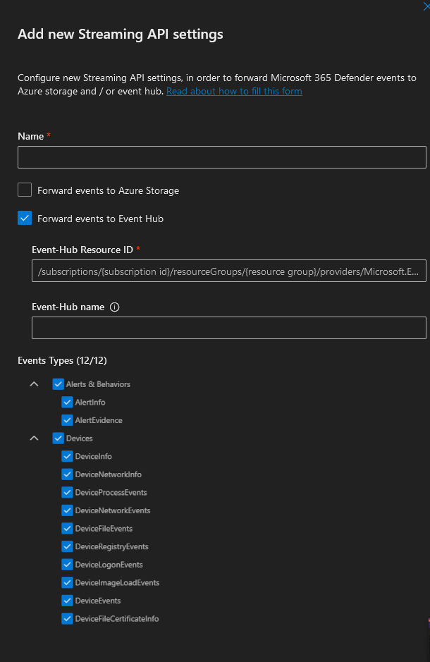

# Connect an Event Hub to Streaming API

## Prerequisites

* Microsoft Defender for Endpoint instance, with at least one connected machine. Check out the [Microsoft Defender for Endpoint P2 Trial](https://aka.ms/MDEp2OpenTrial), if you need one.
* .NET 8.0 SDK. Download a copy at the [Download .NET](https://dotnet.microsoft.com/en-us/download) page.
* Azure CLI tools with the Bicep extension. See [Azure CLI with Bicep](https://learn.microsoft.com/en-us/azure/azure-resource-manager/bicep/install#azure-cli)

## Overview

Here are the steps we'll go through:

1. Deploy an Event Hub Namespace
1. Configure Defender to export events to this namespace
1. Configure this sample with Event Hub connection details
1. Run the sample!
1. Dig deeper into the sample

## Deploy an Event Hub Namespace

First, we need an Event Hub. This needs to be in the same tenant which hosts the Defender instance.

You can use my AzDeploy.Bicep templates. This:

1. Creates an Event Hub namespace `ehubns-{unique}`
1. Creates a single hub under it `ehub`
1. Creates listening and sending keys, so we can use connection strings with least permissions. Here we care about `ListenKey`.

Here's how we deploy it:

```PowerShell
git clone https://github.com/jcoliz/AzDeploy.Bicep.git
cd AzDeploy.Bicep\EventHub

$env:RESOURCEGROUP = "pick-a-group-name"
az group create -n $env:RESOURCEGROUP -l "West US 2"
az deployment group create --name "Deploy-$(Get-Random)" --resource-group $env:RESOURCEGROUP --template-file .\ehub.bicep
```

Have a look at the output for the `outputs.id.value`. This is the ID you'll need to give Defender.

```json
    "outputs": {
      "hub": {
        "type": "String",
        "value": "ehub"
      },
      "id": {
        "type": "String",
        "value": "/subscriptions/{something}/resourceGroups/{your-group}/providers/Microsoft.EventHub/namespaces/ehubns-{unique}"
      },
      "namespace": {
        "type": "String",
        "value": "ehubns-{unique}"
      },
    }
```

Later, when we're done experimenting, be sure to tear down the Event Hub namespace.

```Powershell
az group delete -y -g $env:RESOURCEGROUP
```

## Configure Defender to export events to this namespace

Please have a look at the great video available on the [Streaming API](https://learn.microsoft.com/en-us/defender-xdr/streaming-api) overview page. 
You can find the Streaming API page in the Defender portal under Settings > Microsoft Defender XDR > Streaming API.



Press "Add" to add a new streaming export. Choose a catchy name to help you remember, e.g. "Streaming API test". 
Choose "Forward events to Event Hub." In the "Event Hub Resource ID", you'll enter the ID of the namespace from your deployment
earlier, e.g. `/subscriptions/{something}/resourceGroups/{your-group}/providers/Microsoft.EventHub/namespaces/ehubns-{unique}`. For Event Hub name,
refer to the `outputs.hub.value` from the earlier deployment; this is `ehub`, by default.

For testing, go ahead and check all of the various event types. Later on when you've decided which you need, you can always come back here
to narrow the stream.



Then click "Submit," and a few moments later your new Streaming API connection will be listed in the portal, and you're ready to
watch those events come in.

## Configure the sample

Now we need the connection string for the `ListenKey`. You can run this snippet, being sure to set `$env:EHUBNS` to your unique namespace name.

```Powershell
$env:EHUBNS = "ehubns-{unique}"
az eventhubs namespace authorization-rule keys list --resource-group $env:RESOURCEGROUP --namespace-name $env:EHUBNS --name ListenKey
```

Returns something like this:

```json
{
  "keyName": "ListenKey",
  "primaryConnectionString": "Endpoint=sb://ehubns-{unique}.servicebus.windows.net/;SharedAccessKeyName=ListenKey;SharedAccessKey={something}",
  "primaryKey": "{something}",
  "secondaryConnectionString": "Endpoint=sb://ehubns-{unique}.servicebus.windows.net/;SharedAccessKeyName=ListenKey;SharedAccessKey={something}",
  "secondaryKey": "{something}"
}
```

Copy the file `config.sample.toml` to `config.toml`, then enter your `primaryConnectionString` from above into the `ConnectionString` below.

```toml
[EventHub]
ConnectionString = "--fill me in--"
HubName = "ehub"
```

## Run the sample

With everything connected, and the `config.toml` set up correctly, you can now run the sample to watch the events flow in. Press Ctrl-C when you're done.

```dotnetcli
dotnet run

info: event_hub_listener.Worker[0]
      Starting
info: Microsoft.Hosting.Lifetime[0]
      Application started. Press Ctrl+C to shut down.
info: Microsoft.Hosting.Lifetime[0]
      Hosting environment: Development
info: Microsoft.Hosting.Lifetime[0]
      Content root path: .\defender-endpoint-samples\event-hub-listener
info: event_hub_listener.Worker[0]
      Events: {
        "records": [
          {
            "time": "2024-05-21T23:37:19.7996118Z",
            "tenantId": "6de90c16-b0cb-4759-86b3-5601aec49b50",
            "operationName": "Publish",
            "category": "AdvancedHunting-DeviceEvents",
            "_TimeReceivedBySvc": "2024-05-21T23:33:55.6970602Z",
          }
        ]
      }
info: Microsoft.Hosting.Lifetime[0]
      Application is shutting down...
info: event_hub_listener.Worker[0]
      Cancelled
```

## Dig deeper

The sample uses the `Azure.Messaging.EventHubs` library, and itself is a copy/paste of the [README](https://github.com/Azure/azure-sdk-for-net/blob/main/sdk/eventhub/Azure.Messaging.EventHubs/README.md#read-events-from-an-event-hub) of that project.

I'll restate the note from that project: This approach to consuming is intended to improve the experience of exploring the Event Hubs client library and prototyping. It is recommended that it not be used in production scenarios. For production use, we recommend using the [Event Processor Client](https://github.com/Azure/azure-sdk-for-net/blob/main/sdk/eventhub/Azure.Messaging.EventHubs.Processor), as it provides a more robust and performant experience.

```c#
string consumerGroup = EventHubConsumerClient.DefaultConsumerGroupName;
await using var consumer = new EventHubConsumerClient(consumerGroup, ehubOptions.Value!.ConnectionString, ehubOptions.Value!.HubName);

await foreach (PartitionEvent receivedEvent in consumer.ReadEventsAsync(stoppingToken))
{
    var raw = receivedEvent.Data.EventBody.ToString();
    using var jDoc = JsonDocument.Parse(raw);

    logger.LogInformation("Events: {events}", JsonSerializer.Serialize(jDoc, _jsonoptions));
}
```
