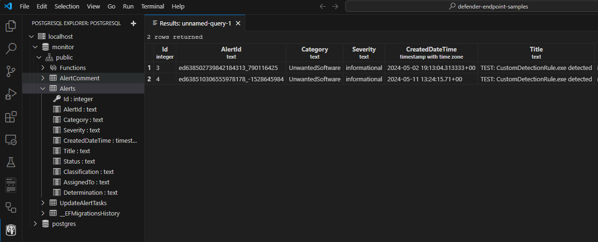

# Monitor and Manage Alerts

This sample will demonstrate a ticketing system, which monitors Microsoft Defender for alerts, stores them in a local database, and
syncronizes changes back to Defender when they are made locally. This sample runs in a container, and works with a Postgres database
running in container.

## Initial configuration

Please see the [README](../README.md) at the top if this repository for necessary pre-requisites
and initial configuration before running the sample.

In particular, this sample requires these API permissions:

* Microsoft Graph: SecurityAlert.Read.All

## Running locally

While the sample is designed to run in a container, this is not required. It can be run locally
for testing and development.

In this situation, we will need a Postgres server available. To bring one up, you can start the
`docker-compose-dbonly` compose project:

```powershell
docker compose -f .\.docker\docker-compose-dbonly.yaml up -d --wait
```

Once you have `config.toml` set up, and the database running, feel free to run the sample locally in this folder.

```powershell
dotnet run

info: MdeSamples.Worker[0]
      Starting
info: Microsoft.Hosting.Lifetime[0]
      Application started. Press Ctrl+C to shut down.
info: Microsoft.Hosting.Lifetime[0]
      Hosting environment: Development
info: Microsoft.Hosting.Lifetime[0]
      Content root path: C:\Source\jcoliz\defender-endpoint-samples\monitor-manage-alerts
info: MdeSamples.Worker[0]
      Received 2 alerts
info: MdeSamples.Worker[0]
      Alert: {
        "AlertId": "ed638510306555978178_-1528645984",
        "Category": "UnwantedSoftware",
        "Severity": "informational",
        "CreatedDateTime": "2024-05-11T13:24:15.71+00:00",
        "Comments": [],
        "Title": "TEST: CustomDetectionRule.exe detected",
        "Status": "new"
      }
info: MdeSamples.Worker[0]
      Added 2 alerts
info: Microsoft.Hosting.Lifetime[0]
      Application is shutting down...
info: MdeSamples.Worker[0]
      Cancelled
```

Right now, the sample connects to the Graph Security APIs, fetches all the alerts
every 30 seconds, and adds the new ones into the database.

Now, we can inspect the database, perhaps using the [PostreSQL Extension](https://marketplace.visualstudio.com/items?itemName=ckolkman.vscode-postgres) for VSCode, to
see that the alerts have been added.



When you're done, you can stop the compose project:

```powershell
docker compose -f .\.docker\docker-compose-dbonly.yaml down
```

## Building the container

Once you're happy with it running locally, you can build it into a container and run it there.
From a terminal window in this folder:

```powershell
.scripts/Build-Container.ps1
```

## Running the container

Once the container is built, and you have `config.toml` set up:

```powershell
docker compose -f .docker/docker-compose.yaml up

[+] Running 1/0
 ✔ Container monitor  Recreated                                                                                    0.1s
Attaching to monitor
monitor     | info: MdeSamples.Worker[0]
monitor     |       Starting
monitor     | info: Microsoft.Hosting.Lifetime[0]
monitor     |       Application started. Press Ctrl+C to shut down.
monitor     | info: Microsoft.Hosting.Lifetime[0]
monitor     |       Hosting environment: Production
monitor     | info: Microsoft.Hosting.Lifetime[0]
monitor     |       Content root path: /app
monitor     | info: MdeSamples.Worker[0]
monitor     |       Received 2 alerts
monitor     | info: MdeSamples.Worker[0]
monitor     |       Alert: {
monitor     |         "AlertId": "ed638510306555978178_-1528645984",
monitor     |         "Category": "UnwantedSoftware",
monitor     |         "Severity": "informational",
monitor     |         "CreatedDateTime": "2024-05-11T13:24:15.71+00:00",
monitor     |         "Comments": [],
monitor     |         "Title": "TEST: CustomDetectionRule.exe detected",
monitor     |         "Status": "new"
monitor     |       }
monitor     | info: MdeSamples.Worker[0]
monitor     |       Added 2 alerts
```
